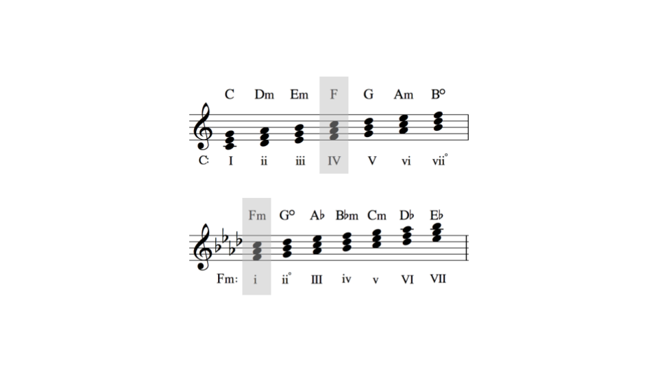

# Composer

## Overview

This project explores procedural music generation. It tries to answer the question: what is the difference between sound and music?

## Modes

## Progressions

## Modulations

## Inversions

## Arppegios

